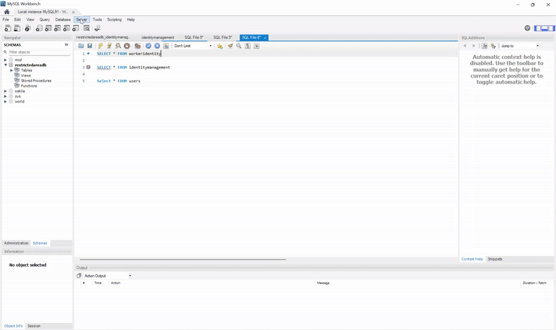

# Inappropriate Behaviour Detection System

This project is an AI-driven monitoring system designed for the oil & gas industry to enhance safety compliance.
It integrates:

- Computer Vision for inappropriate behaviour detection (phone usage, smoking, vaping).

- Face Recognition to identify registered workers using badge IDs.

- Real-time API service (FastAPI) for integration with external applications.
---

## Features

- Behaviour Detection using YOLO models (custom-trained).

- Worker Face Recognition powered by FaceNet & embeddings.

- Admin-controlled Face Data Management (badgeID-based folder + image uploads).

- Automatic Embeddings Reload after retraining.

- Database Integration with MySQL (WorkerIdentity, IdentityManagement).

- REST API Endpoints via FastAPI.

---

## Project Structure

```
inappropriate_behaviour_v3/
├── database 
├── face_data/                         # Per-person image folders
├── model/                             # YOLO weight files
│   ├── inappropriate_behaviour.pt
│   ├── ppe_model.pt
│   ├── yolo11n.pt
│   ├── yolov11n-face.pt
├── scripts/
│   ├── train_face1.py                 # Embedding trainer
│   ├── monitoring3.py                 # Live monitoring script
│   ├── auto_trainer.py                # Watchdog → retrain glue
│   ├── face_encodings.pkl             # Generated at runtime
│   ├── main.py
│   ├── api2.py
│   ├── auth_api6.py
│   └── pkltimestamp                   # Generated at runtime 
├── requirements.txt                   # Python dependencies
├── .env
┗ README.md

```

---

##  Getting Started

### 1. Clone the Repository

```bash
git clone https://github.com/Aqhari/inappropriate_behaviour_v3.git
cd behavior-monitor
```

### 2. Create & Activate Virtual Environment

```bash
python3 -m venv venv
source venv/bin/activate   # Linux/macOS
venv\\Scripts\\activate  # Windows
```

### 3. Install Dependencies

```bash
pip install --upgrade pip
pip install -r requirements.txt
```

### 4. Prepare Data & Models

* **face\_data/**: Populate with subfolders named after each person, each containing their face images.
* **model\_checkpoints/**: Ensure YOLO weight files (`.pt`) are placed here:

  * `yolov11n-face.pt` (face detector)
  * `yolo11n.pt` (person detector)
  * `inappropriate_behaviour.pt` (object/behavior detector)

---

##  Usage

### 1. Start Auto-Trainer

Automatically retrains embeddings when `face_data/` changes:

```bash
python scripts/auto_trainer.py 
```

### 2. Run Live Monitor

Launch the real-time monitoring and recognition:

```bash
python scripts/monitoring2.py --video <camera_source> --identity-persistence-ttl 5
```

* Replace `<camera_source>` with your camera index or RTSP URL.
* Press `q` to quit the live window.

### 3. Key Endpoint

| Method | Endpoint                | Description                                                  |
| ------ | ----------------------- | ------------------------------------------------------------ |
| `POST` | `/recognize`            | Recognize faces & detect behaviour (base64 frame)            |
| `POST` | `/recognize_file`       | Recognize faces & detect behaviour (image file)              |
| `GET`  | `/worker/{person_name}` | Fetch worker details from DB                                 |
| `POST` | `/face/create_folder`   | Create worker face folder (Admin only, badgeID required)     |
| `POST` | `/face/upload_images`   | Upload face images for worker (Admin only, badgeID required) |


---
## Database Schema

Kindly Import the Database table from Database Folder into local machine

```bash

-- Create the database if it doesn't exist
CREATE DATABASE IF NOT EXISTS restrictedareadb;

-- Grant permissions to your app user
GRANT ALL PRIVILEGES ON restrictedareadb.* TO 'admin123'@'localhost';

-- Ensure the password is correct
ALTER USER 'admin123'@'localhost' IDENTIFIED BY 'Petro@1234';

-- Apply changes
FLUSH PRIVILEGES;

-- Exit root session
EXIT;

```

 


---
## Notes

- Only Admin (BadgeID = B0000) can create face folders and upload images.

- Face recognition requires training (train_face2.py) before running API.

- Embeddings reload automatically when retrained.

- PLEASE MAKE SURE ALL FILE PATH IN THE CODING SCRIPTS  CORRECT ACCORDING YOUR LOCAL PATH


"# _inappropriate_behaviour_v3" 
